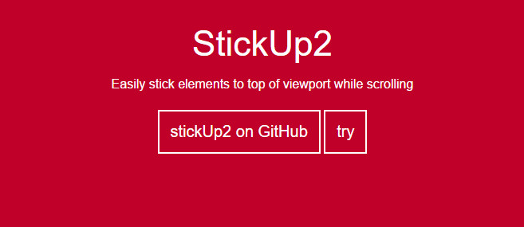

stickUp2
=======
a jQuery plugin


[](http://ppowalowski.github.io/stickUp2/)

A simple plugin that "sticks" elements to the top of the browser window while 
scrolling past it. For better experience it optionally offers autohide with 
reappearence after scrolling up.

Please Visit the <a href="http://ppowalowski.github.io/stickUp2">GitHub Page</a> 
for installation instructions.

### Updated version

This version contains a major code cleanup with several improvements

+ [+] multiple instances possible
+ [+] sticky sidebar feature (with elements bigger than viewport)
+ [+] fancy autohiding of sticked elements which reappear on scroll up
+ [-] no more one pager highlighting features

##Configuration options

###General

**scrollHide**  
When ticked stickUp will keep the element hidden when scrolling past it but show 
it immediatly when scrolling up again (like adressbar in Chrome for Android).
This feature allows better screen space usage while offering the sleek UI 
shortcut of standard sticking behavoiur.  
**Only works with elements smaller than viewport.**
```
default: true
options: integer
```

**lazyHeight**  
Similar to scrollHide but not hiding element. It rather adds the set value while
scrolling up. Good for streamlining appearance and avoid overlapping
when introducing multiple sticky elements with one autoHiding at top.
```
default: 0
options: integer
```

**topMargin**  
option to control margin of sticked element
```
default: 'auto'
options: 'auto', number, '10px'
```

**disableOn (>2.2.0)**  
Option to disable scrollUp if passed function returns false
```
default: 'function(){return true}'
options: function
example: 
function(){
    if( $(window).width() < 768 )
        return false;
    return true;
}
```

**namespaceClass (>2.3.0)**  
option to control set the class which is added to the main element to 
which stickUp is applied
```
default: 'stuckElement'
options: string
```

**fixedClass (>2.3.0)**  
option to set the class which is added to the main element to 
which stickUp is applied when in fixed state
```
default: 'isStuck'
options: string
```

**keepInWrapper**  
option to control wether the sticked element is caught in a wrapping container
```
default: false
options: boolean
```

**wrapperSelector**  
selector of container to hold the sticky element  
(only in conjunction with keepInWrapper)
```
default: '' // uses first parent if empty
options: 'selector'
```

**syncPosition**  
forces stickUp to synchronize left position  
(use if positioning needed for example with margin auto)
```
default: false
options: boolean
```

## WANTED: Contribution
##### Tests
+ test environment needed to avoid manual testing failure
+ test cases covering all special scenarios

##### Events / API / Architecture
+ emission of events on state change
+ API to control status of stickUp
+ rework jQuery plugin pattern (better module?)
+ Angular directive

The original (v1) implementation can be found at 
[LiranCohen repository](https://github.com/LiranCohen/stickUp

stickUp2 is a substantial rebuild and published under MIT
